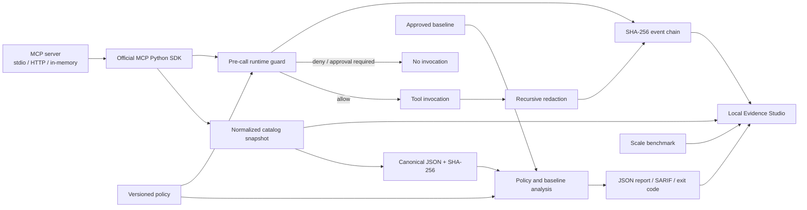

# Architecture

MCP TraceGuard separates protocol collection, deterministic policy decisions,
evidence generation, and human review. No model participates in a security
decision.

## Components

| Component        | Responsibility                                               | Deterministic output                            |
| ---------------- | ------------------------------------------------------------ | ----------------------------------------------- |
| `snapshot.py`    | Paginate `tools/list`, normalize contracts, write atomically | Catalog snapshot and tool fingerprints          |
| `schema_diff.py` | Compare approved and observed tool contracts                 | JSON Pointer changes with impact classes        |
| `analysis.py`    | Apply catalog policy and baseline rules                      | Findings, exit decision, explainable risk score |
| `runtime.py`     | Decide before invocation, redact evidence, seal a trace      | Runtime decision and execution trace            |
| `scenarios.py`   | Replay adversarial expectations                              | Per-case checks and category scores             |
| `sarif.py`       | Map catalog findings to SARIF 2.1.0                          | Stable rule IDs and partial fingerprints        |
| `benchmark.py`   | Measure CPU-side scale and enforce budgets                   | Timing report and budget verdict                |
| `web/`           | Review artifacts without a backend                           | Local rendering, trace verification, approvals  |

## Data flow and invariants

1. Tool contracts are sorted by name and serialized as canonical JSON before
   hashing. Key order therefore cannot create false drift.
2. Catalog analysis never invokes a tool. It only consumes advertised
   contracts.
3. Runtime policy is evaluated against the original arguments before a call.
   `deny` outranks `require_approval`, which outranks `allow`.
4. Arguments and responses are redacted before they enter a persisted event.
5. Every trace event commits to its predecessor and content. The final seal
   commits to metadata, the event root, and the summary.
6. The Python CLI and TypeScript studio verify the trace independently.

## Extension points

- Add catalog checks as stable `TGxxx` rules in `analysis.py`, then map them in
  `sarif.py` and add fixtures.
- Add runtime operators in `RuntimeCondition`, `_condition_matches`, the policy
  schema, and adversarial cases together.
- Add new artifacts as strict Pydantic models, export their JSON Schema, and
  explicitly teach the studio how to detect and render them.
